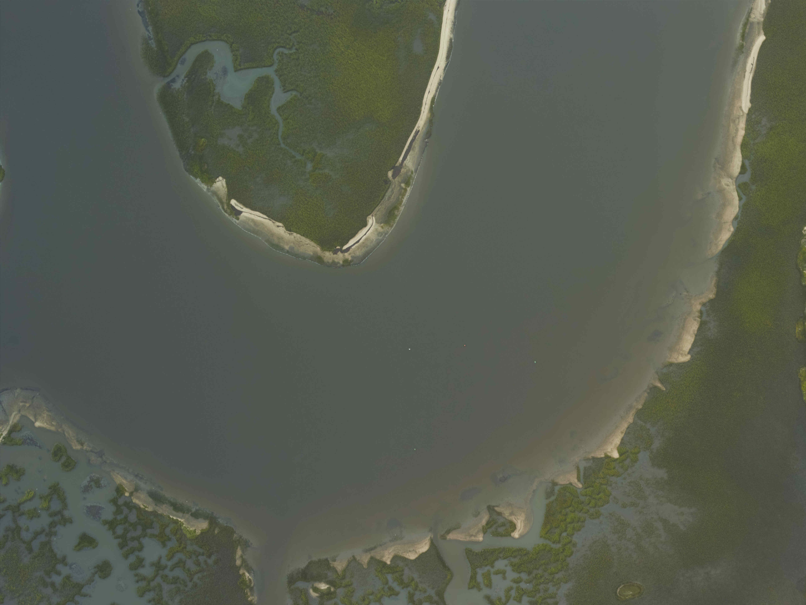

Doodler works well with small to medium sized imagery where the features and objects can be labeled without much or any zoom or pan. This depends a lot on the image resolution and content so it is difficult to make general guidelines.

But it's easy enough to chop images into pieces, so you should experiment with a few different image sizes.

Let's start with this image called `big.jpg`:


I recommend the command-line program [imagemagick](https://imagemagick.org/index.php), available for all major platforms. It's an incredibly powerful and useful set of tools for manipulating images. You can use the imagemagick command line [tools](https://imagemagick.org/script/command-line-processing.php) for splitting and merging imagery. We use the `magick` command (`convert` on some Linux distributions)

## Halves
Split into two lengthways:

```cmd
magick big.jpg -crop 50%x100% +repage fordoodler_%02d.jpg
```


## Quarters
Following the same logic, to chop the image into quarters, use:

```cmd
magick big.jpg -crop 50%x50% +repage quarters_fordoodler_%02d.jpg
```

The first two quarters are shown below:




## Specific size
To chop the image into tiles of a specific size, for example 1024x1024 pixels, use:

```cmd
magick big.jpg -crop 1024x1024 +repage px1024_fordoodler_%02d.jpg
```

The first three tiles are shown below:


Easy peasy!

## Recombine

After you've labeled, you may want to recombine your label image. Imagemagick includes the [montage](https://imagemagick.org/script/montage.php) tool that is handy for the task. For example, the image quarters can be recombined like this:

```cmd
magick montage -mode concatenate -tile 2x2 quarters*.jpg recombined.jpg
```
and the equivalent command to combine the two vertical halves is:

```cmd
magick montage -mode concatenate -tile 2x1 fordoodler*.jpg recombined.jpg
```

Happy image cropping!
