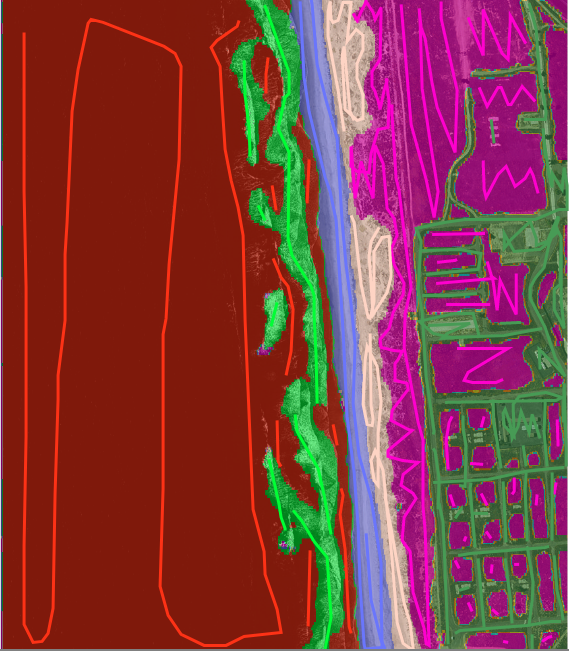
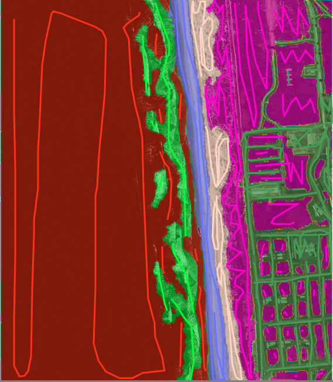
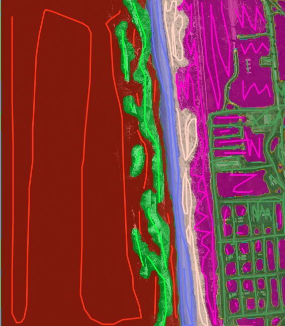

What *are* the blur and model independence factors?  

The are both names I made up for parameters of the CRF model used on the image-by-image or 'local' level of prediction, as described in the [How Doodler works](https://dbuscombe-usgs.github.io/dash_doodler/docs/tutorial-extras/how-doodler-works) section.

What do they mean? When should their values be changed? Read on ...

### Blur factor

### Model independence factor

