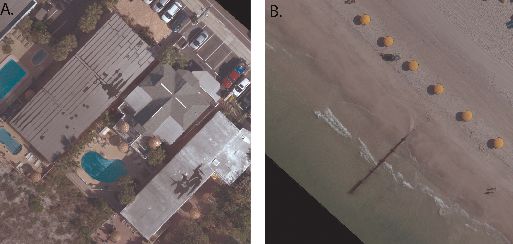
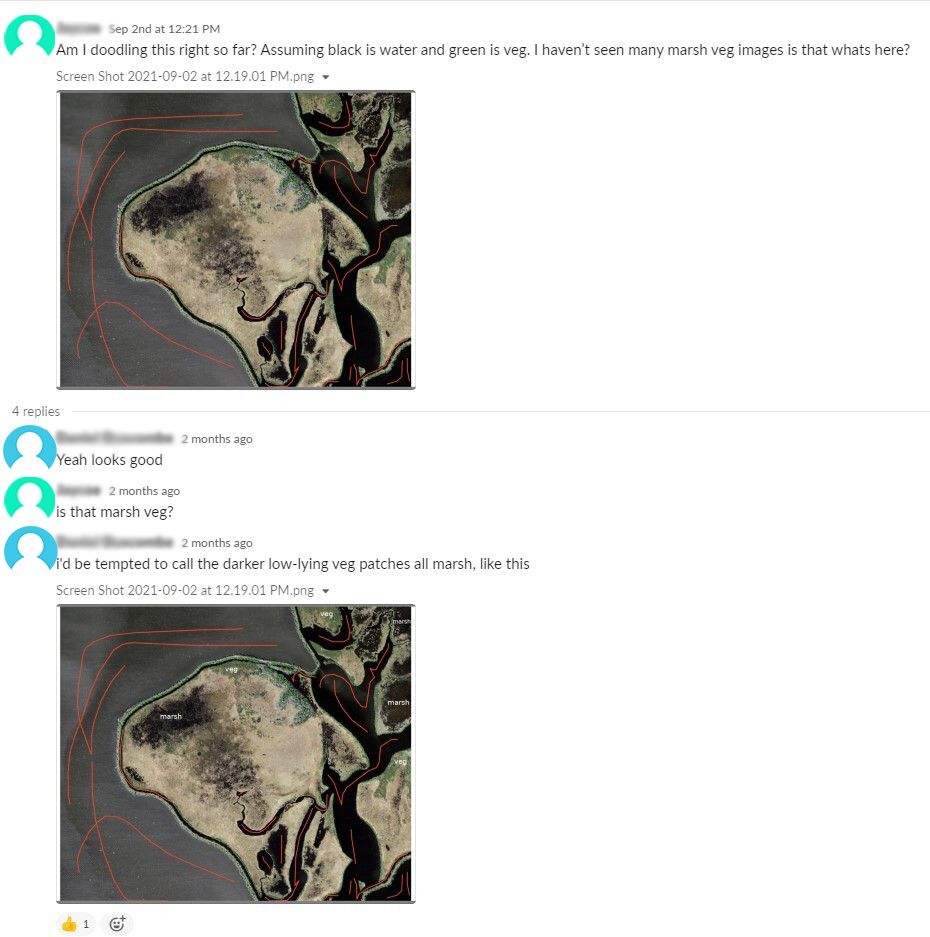
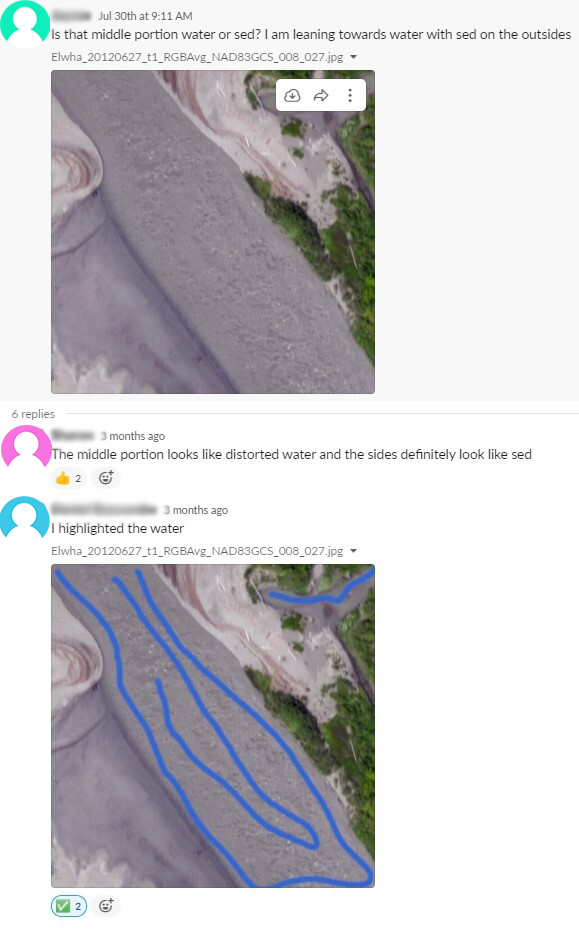

Get a behind the scenes look into the team working with Doodler, the workflow, Doodler's evolution and much more!

<!--truncate-->

## The Story Behind Doodler

This blog post was written to be transparent about the workflow and the methods used by the team that utilized the software developed by Daniel Buscombe, Doodler, to segment hundreds of ariel images. This blog will discuss the backgrounds of the team members, the training they underwent, their experience Doodling(annotating the images ), and how Doodler evolved over time to meet the needs of the team. Throughout the course of this blog, I will be using the term "Doodlers" to refer to the team annotating the images, the term "Doodling" to refer to the process of annotating the images, and "Doodler" refers to the software itself. 

## The Team

### Backgrounds of Team Members

The Coast Train team who labeled hundreds of images consisted of several USGS contractors, researchers, and two student contractors. One student contractor was a Computer Science major with negligible knowledge of geosciences and the other was an Earth Science major. Both contributed different expertise that in combination was beneficial to the labeling process as it required an understanding of both machine learning and recognition of coastal/earth processes. The student contractors assisted by annotating hundreds of images and over the course of annotating it became increasingly evident their respective backgrounds impacted the bias of the annotations.

## Annotating with Doodler

### The Training

The training was given in June of 2021 using a video-sharing platform to an audience of student contractors and researchers. The training was led by the lead developer and inventor of Doodler, Dan Buscombe, who shared a live feed of him utilizing Doodler. The training began with an explanation of what Doodler was, its purpose, and how to download and start the software. Once it was verified that everyone in the meeting had downloaded and started Doodler on their personal machines the training on how to utilize Doodler began. First, it was shown how to annotate the images and load in different classes that corresponded to the landforms present in the image followed by a brief explanation of how to use the zoom and erase tools along with the classifier settings. The classifier settings consisted of sliders to adjust the downsample factor, independence factor, and blur factor. The purpose of each slider was explained, but it was warned that the team should prioritize modifying doodles before adjusting these sliders as modifying doodles is more effective and faster.

### The Workflow

A typical session of Doodling involves first downloading the necessary images and classes.txt file that corresponded with those images. The classes file was given during the week’s meeting where the images that needed to be annotated were provided as well. Once the images and classes files are placed into their respective directories within Doodler. The Doodler(the individual labeling the images) runs a series of commands to start Doodler then loads Doodler in their browser of choice. The Doodler(the individual labeling the images) analyzes the image and uses their prior experience or provided examples from that week’s meeting to decide which classes they will label in that image. Depending on the size of the landform in the image the Doodler may adjust the pen width using the slider to the right of Doodler. The Doodler would then would select a class and label the corresponding landform(s) in the images by using the pen. If they make a mistake they could click the doodle, then select the erase tool to erase it. [Tutorial for the Erase Tool](/blog/2021/07/08/Doodler-Erase)Once the Doodler is satisfied with their doodles they select the checkbox that says "Compute/Show Segmentation", which causes Doodler to utilize the annotations to create a segmented image that identifies all the landforms in the image.

### Common Challenges to Doodling

1. Data Quality
   One of the biggest challenges encountered by all Doodlers was image quality variations in the datasets. Some images such as the orthomosaics shown below were high quality and detailed meaning the doodlers had an easier time identifying objects at the expense of needing to ask for additional guidance on how to label new items appearing in the images like the beach umbrellas shown below. There was also the problem of low-quality images from satellites where it was difficult for Doodlers to distinguish landforms from each other. Additionally, objects like clouds or missing chunks of the images posed new problems as previous iterations of Doodler sometimes had difficulty identifying clouds. Fortunately, these issues were solved by adding new classes to account for these anomalies, and Doodler's code was upgraded to improve cloud recognition

2. Location Differences

Another challenge Doodlers had to overcome was recognizing the same landforms in different regions. For instance, marsh in the regions along the west coast looked different than marsh along the east coast and Doodlers discovered there was a learning curve to recognizing the landforms in different regions. Additionally, factors like lighting, cloud cover, camera angle, and image quality impacted the appearance of landforms. A landform in low lighting on cloudy days looks completely different than the same landform on a sunny day due to the changes the shadows cast and visibility. A rocky surface casts different shadows depending on the time the image was taken leading to it looking different depending on time. There have been multiple case studies using Doodler to analyze how doodler identifies landforms in time-series images.

Fortunately for the Doodlers, the team consisted of a few experts in ariel imagery who could be consulted on how to label difficult images. The Doodler would post an image with annotations that highlighted where the doodler had high uncertainty regarding the class the landform should be labeled as. The expert would then either confirm the Doodler's guess or re-post the image with the correct labels. It should be noted that even the experts had some degree of bias in their decisions as identifying landforms is not a black and white decision as different experts have contradicting conditions for what qualities distinguish landforms as was discovered from the Expert Panel Meetings.

3. Doodler Performance and Image Size

Doodler utilizes machine learning to aid Doodlers in annotating images, which means that it consumes a lot of RAM. The larger the image is the more RAM Doodler requires to label it. This means on computers with 8GB of RAM or less Doodler would consume all the available RAM causing the segmentation process to slow drastically or would cause the computer to crash. You can read a more in-depth explanation here [Doodler's Evolution and its Impact on workflow](#doodlers-evolution-and-its-impact-on-workflow).
Doodler's code has been upgraded to make this issue less problematic, but sometimes the images were still too large for Doodler to process. The solution in the event this happened was to break the image into quarters, which are smaller and thus much faster to annotate. The only downside to this method is that the original image must be "stitched" back together once the labeling is done.

### Communication and Resolving Conflicts

1. What meetings were like

Following the conclusion of training, each week a meeting took place via video chat to discuss progress on labeling each week’s respective dataset, challenges encountered, and assign new datasets along with corresponding classes for the upcoming week's dataset. During these meetings, Doodlers were given a preview of the new dataset and warned of challenges they would need to overcome to successfully label the dataset. The challenges discussed typically were low-resolution imagery, the presence of new classes never encountered by Doodlers previously, or modifications to Doodler's code that impacted the Doodlers’ workflow. Following the meetings, the labelers independently reviewed and labeled each image utilizing the classes given during the meeting.

2. How interactions occurred

Under circumstances where the Doodlers were uncertain as to how to label landforms in the image, they would post the image on a workplace communication forum and ask questions about landforms or structures they were uncertain about. The experts in Ariel and landscape imagery would answer the question and sometimes post images with labels highlighting the landforms they thought belonged to each class. Fellow Doodlers who had labeled similar images would occasionally chime in and provide their estimate based on their prior experience. These examples could be consulted by Doodlers later when they encountered similar landforms and served as a "ground truth" to maintain consistency amongst the Doodlers. The key idea maintained in all conversations on how to label ambiguous landforms was that all Doodlers need to above all else maintain consistency with other Doodlers' labels as this would greatly impact the models created from the segmentations.

## Doodler's Evolution and its Impact on Workflow

As the team using Doodler grew more unique images with varying landforms, lighting, weather, and image quality were being labeled by Doodler. During the course of the project, more ways to improve Doodler were discovered that improved Doodler's ability to identify more landforms under a variety of circumstances. I've listed three of the major improvements below.

1. Doodler No Longer "Remembers" How it Segmented Past Images

Doodler used to keep a record of past images it had segmented and used them to segment new images. This in theory would let Doodler "learn" what different landforms looked like as more images were annotated. Doodler became excellent at recognizing sediment and water, except the only problem is it would try to find the classes it had encountered in the past even when they were not present in the image leading to bad image segmentations. In the current iteration of Doodler, it no longer remembers the images it has segmented before so each image can be handled independently.

2. Doodler Adapts to Low RAM Machines

Not all members of the team had computers with equal specs meaning that Doodler had to work on a variety of machines with varying sizes of RAM and CPUs. One common issue Doodlers utilizing computers with low ram encountered was not being able to process images large than 2MB without it taking over 30 minutes or freezing their computer altogether. To resolve this two approaches were taken: one the large images were broken into small images that could be labeled and two Doodler's code was upgraded to no longer use parallel processing on computers with RAM < 10GB. This decreased the time it took to segment all images for computers with RAM < 10GB.

3. More Sliders were Added to Aid Low Ram Machines

To better optimize Doodler to work on a variety of computers more sliders were added to Doodler's sidebar. An additional setting under 'Classifier settings' called 'Number of scales', which works like so: "the smallest 'sigma' doodler uses to extract features is 0.5, and the largest is 16 (pixels). When number scales = 6, Doodler will generate 3 x 5 x 6 = 90 feature maps for prediction (3 = number of image bands, 5 is the number of feature types, and 6 is the scales). If the number of scales is 6, Doodler uses 6 scales generated between 0.5 and 16, and when the number of scales is 2, Doodler only uses 0.5 and 16. Your computer has to have enough memory to store all 90 temporarily before writing to a memory-mapped file. For larger images and 'lower spec' machines, this can cause Doodler to crash"(Dan Buscombe).

