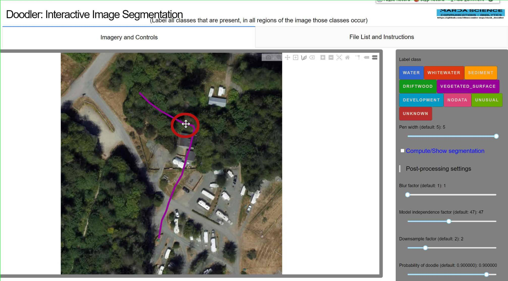
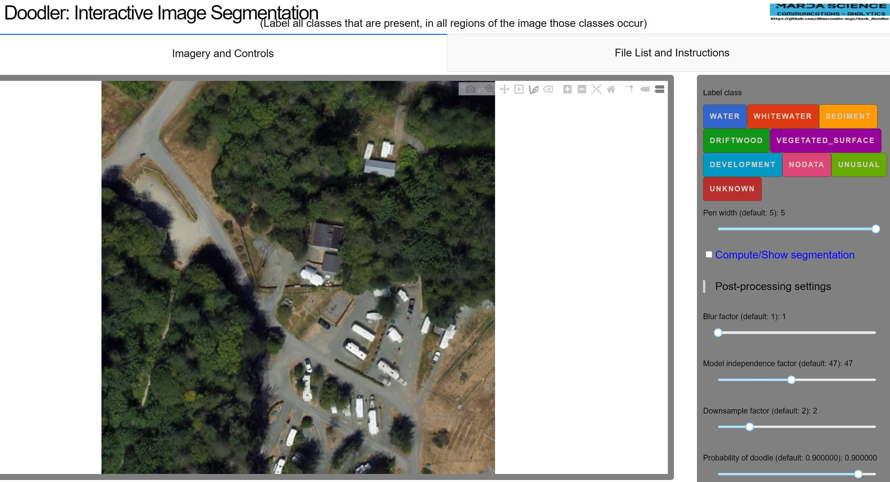

Tutorial: How to use the erase tool in doodler.
<!--truncate-->
## Erase Tool

Hello!
Today I will be showing you how to use Doodler's erase tool to delete doodles.
## Steps
In the screenshot below you can see the erase tool icon in a red circle.

1. First, click on the doodle you want to erase (you may need to click it several times). 

2. Make sure your doodle is ** actively selected ** and you see several dots on the doodle as shown below.

3. Click the erase icon and your actively selected doodle will erase.

Congrats! :tada:

 You have now erased your first doodle!

