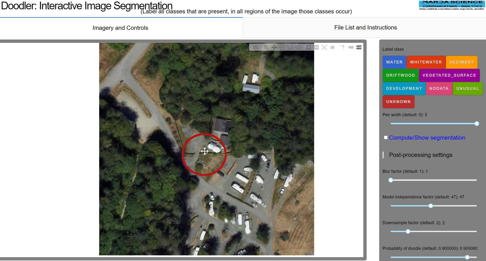
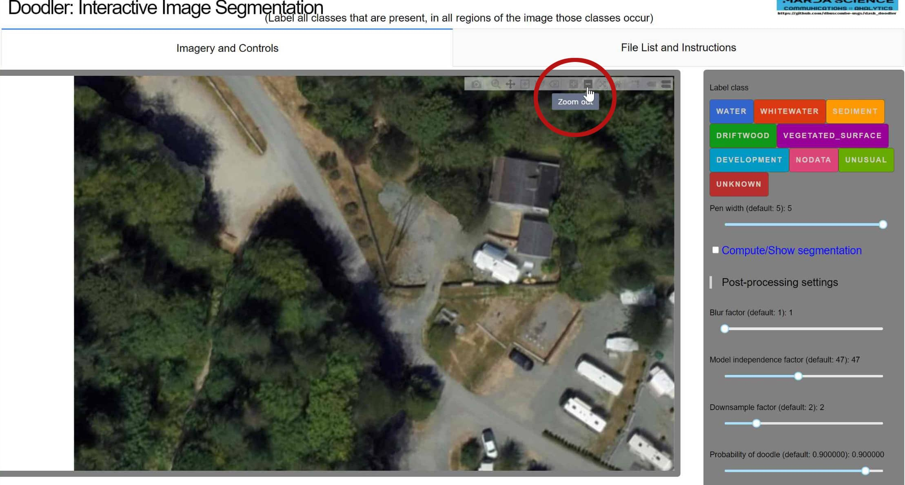

Tutorial: How to use the zoom and pan tools in doodler.
<!--truncate-->

Hello!  
Today I will be showing you how to use Doodler's zoom tool to see details in images.

In the screenshot below you can see the zoom tool icon in a red circle.
### Zoom In Icon

Click the zoom tool and you will see it has zoomed into the image.

Great! Now that we have zoomed in lets move to another part of the image. Click the pan icon circled in red.
### Pan Icon

Your cursor should now look like the move icon. Click and drag to move around on the image.

Note: In the current iteration of doodler once you click the pen icon to draw or click a new class the image will automatically zoom out to its original position. 

To zoom out click the minus(-) icon circled in red.
### Zoom Out Icon

