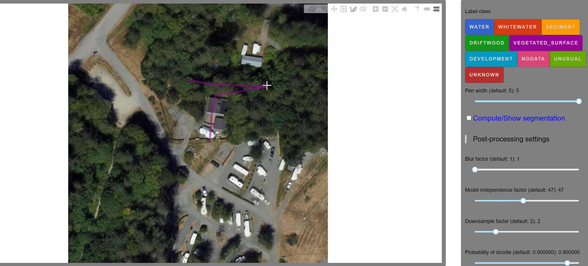

Tutorial: How to change doodles shapes in doodler.

<!--truncate-->
## Change a Doodle's Shape
To change the shape of the doodle you must actively select the doodle. A doodle has been actively selected when dots appear along the doodle. You can drag these dots to change the doodle's shape.

### Steps

1. First, actively select the doodle, so dots appear on the doodle.

2. Second, click the dot on the doodle you want to  move a hand icon should appear.
    
3. Third, pull the dot to the place you want.
    
4. Congrats! :tada: You have  changed your doodle's shape. 

